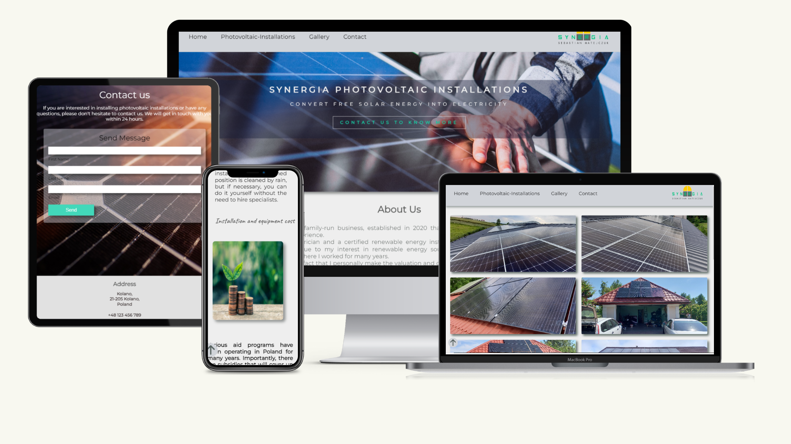
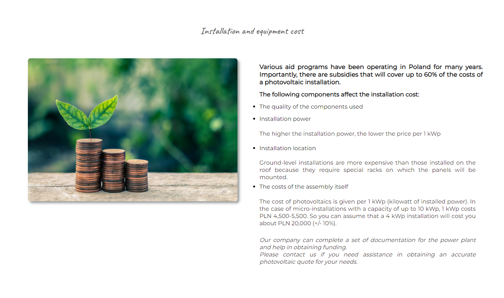
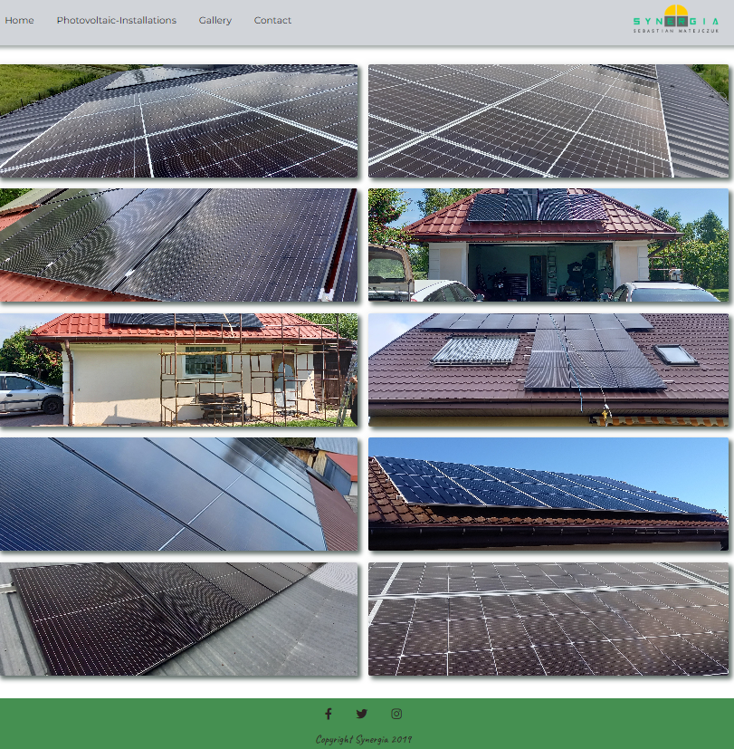

# **_Synergia Photovoltaic_**
The Synergia is a family-run business,specializing in installing photovoltaic panels, which are an ecological source of energy.

# Contents

* [**User Experience UX**](<#user-experience-ux>)
    * [Site Structure](<#site-structure>)
    * [Design Choices](<#design-choices>)
    * [Typography](<#typography>)
    * [Colour Scheme](<#colour-scheme>)

* [**Features**](<#features>)
   * [Main Page](<#main-page>)
   * [Photovolatic Instalation Page](<#Photovolatic- Instalation -page>)
   * [Gallery Page](<#Gallery-page>)
   * [Contact Page](<#Contact-page>)
* [**Technologies Used**](<#technologies-used>)
* [**Testing**](<#testing>)
* [**Deployment**](<#deployment>)
* [**Credits**](<#credits>)
    * [**Content**](<#content>)
    * [**Media**](<#media>)
*  [**Acknowledgements**](<#acknowledgements>)
        
# User Experience (UX)

## Site Structure

The Synergy website contains four pages. 
The home page is the default loading page, gallery, about us and contact pages are all accessible primarily from the navigation menu. 

[Back to top](<#contents>)

## User Stories

- As a user I want to be able to navigate through the whole site smoothly.
- As a user I want to understand the purpose of the site upon loading it.
- As a user I want to understand what the photovoltaic installation is, what are the cost's, etc.
- As a user I want to see examples of already done installations.
- As a user I want to know more about the Synergia company.
- As a user I want to connect with the company on social media.
- As a user I want to be able to contact the Synergia for more information.

[Back to top](<#contents>)

## Design-choices
 * ### Typography
      * The fonts chosen were 'Caveat', 'Erica One family' and 'Montserrat'.
 * ### Colour Scheme
      * The colors on the page are subdued. White background, green footer, and gray navigation bar.

[Back to top](<#contents>)

## Existing Features  
# Features

The Synergia site is projected to be welcoming and easy to use. It contains a navigation bar and a contact form. The aim is to invite the user to get to know the page.

## Existing Features  
# Features

The Synergia site is designed to be easy to navigate and to encourage the user to explore more information about the company. 

## Main Page

* ### Navigation Menu

* At the top of all the pages the user can find a fully responsive navigation menu, which had links to all the pages of the site to enable ease of navigation on the page.
* The logo is clickable with a link back to the home page.

[Back to top](<#contents>)

* ### About-Us
 * The About Us section tells the user more about the company.
 * The picture of the owner and getting to know more about him can bring confidence that the project will be taken care of by a small
 

[Back to top](<#contents>)

* ## Photovolatic Instalation Page

It is divided into three sections:
* What is a photovoltaic installation? (giving a description of what photovoltaic installation is).

[Back to top](<#contents>)

* Why is it worth investing in a photovoltaic installation? (showing the benefits of installing photovoltaic panels).

[Back to top](<#contents>)

* Installation and equipment cost (explaining what influences the cost of installation as there is no one fixed price and the cost depends on many different factors).

[Back to top](<#contents>)

* ## Gallery page

* The Gallery page includes photos of already-made installations.
* This section is valuable to the user as it can help them make their decisions about buying the installation and proves the reliability of the company.

[Back to top](<#contents>)

* ## Contact us page

This page will allow the user to get in contact with Synergia company.
* There is a form that the user can choose to fill in. User can submit their contact details, and the owner will get in touch 
  within 24 hours.
* The contact us page has a map (the location of the real company is not shown due to privacy reasons), 
* Users can find here an address, phone number, and email address details.

[Back to top](<#contents>)

## Technologies Used
* `HTML` provides the content and structure for the website.
* `CSS` provides the styling.
* [Gitpod](https://www.gitpod.io/#get-started) - used to deploy the website.
* [Github](https://github.com/) - used to host and edit the website.

[Back to top](<#contents>)

## Testing

Please refer to [**_here_**](TESTING.md) for more information on testing.

[Back to top](<#contents>)

## Deployment

The site was deployed to GitHub page.

[Back to top](<#contents>)

## Credits
### Content

* The map is embedded from [Google Maps](https://www.google.com/maps).
* The icons came from [Font Awesome](https://fontawesome.com/).
* How to organize galleries [YouTube tutorial](https://www.youtube.com/watch?v=rnhoY5Cdmy0&t=580s).
* Link how to add a logo and style it [YouTube tutorial](https://www.youtube.com/watch?v=Jkp103YhW7A).
* The inspiration for the Readme file came from this repository on [GitHub](https://github.com/EwanColquhoun/wawaswoods/blob/master/README.md).

[Back to top](<#contents>)

### Media
* The photos for the front cards came from [Creative Fabrica](https://www.creativefabrica.com/)
* The photo on the Main page comes from [Feepick](https://pl.freepik.com/)
* The photo on the Contact Us page comes from [Feepick](https://pl.freepik.com/)
* The photo in the Gallery Page are the original photos from the owner of a Synergia company.

[Back to top](<#contents>)

## Acknowledgements

The website was completed as a Portfolio Project 1 made for the Full Stack Software Developer (e-Commerce) Diploma at the [Code Institute](https://codeinstitute.net/). 

I would like to thank all at the Code Institute for their help and support.

[Back to top](<#contents>)